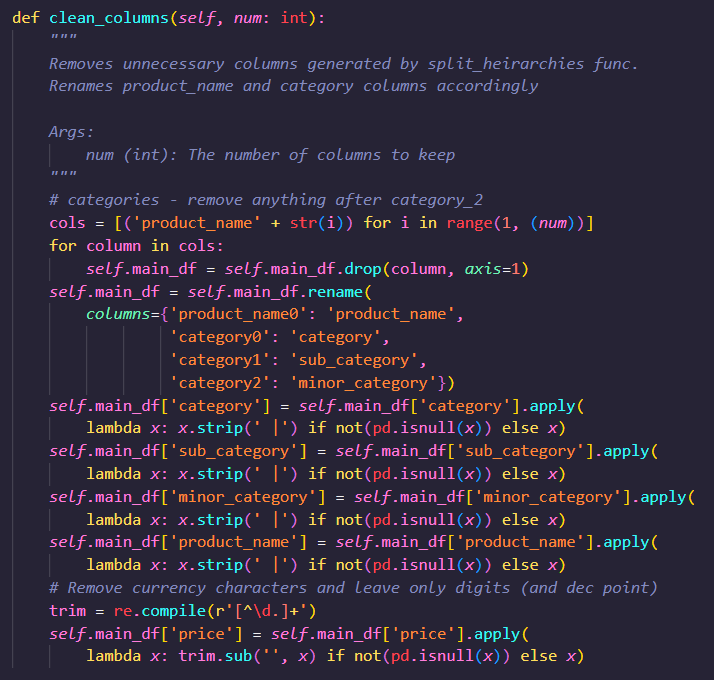
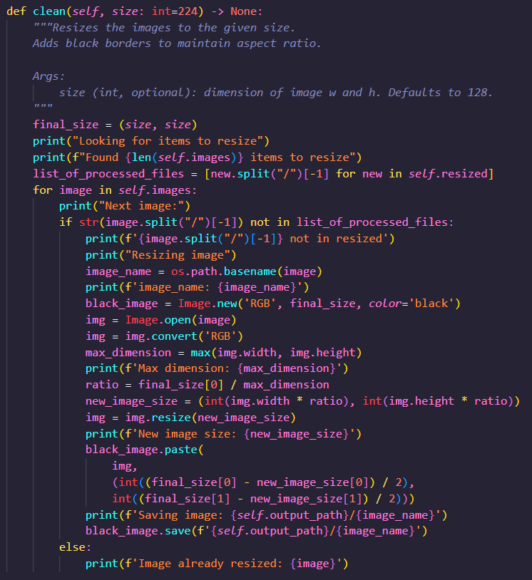
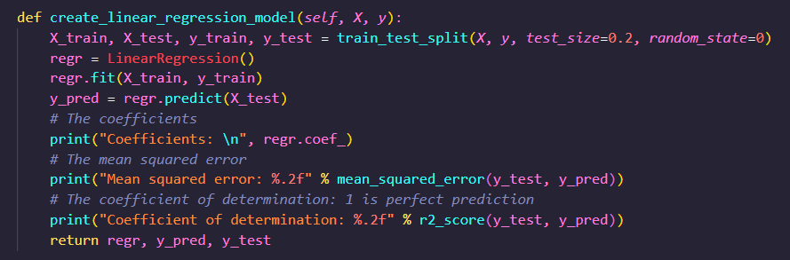

# MarketPlaceML
Creating a Facebook style marketplace data pipeline. By the end of the project, I will have...

• Processed and cleaned text and image datasets
• Designed and trained a multimodal model that combines images and text to generate embedding vectors to create a search index using Pytorch
• Developed a recommendation system based on the demographic information about potential buyers using the FAISS library from Facebook
• Created a pipeline to systematically clean new data and upsert it into a database
• Containerized the model and orchestrated the containers using Kubernetes
• Monitored and retrain the model using Kubeflow deployed on EKS 

## Milestone 1
Given an S3 bucket of images and a flat-file data base - I have information such as price, location and description. Most of the data is text, but as text is generally poor for ML use, it was needed to be converted into numerical data.

Main tasks:
• Split the "category" data into its Main, sub-, and bottom category.
• Discard poorly formed data
• Discard rows with NaNs present across the board
• Clean the price information into float, disregarding currency decoration.



Next, I created a simple image cleaning class, which takes in images of various dimensions, channels, filetypes etc, and exports them to a consistent target size and channels.

In my script the default image size is 224 x 224. Black bars are automatically added to the sides, or above and below, for images that are long or wide.




## Milestone 2

Creating simple regression models.
This was never going to work in this situation, as there isn't a linear relationship between the category of a product and its price, but the exercise was useful inasmuch as it introduced me to the idea of using linear regression to predict outcomes.



Creating a simple classification model.
The previously cleaned images are then flattened into numpy arrays and, combined with the categorical information, a simple model is produced to predict what category each image is from. 

## Milestone 3


## Conclusions

- Maybe write a conclusion to the project, what you understood about it and also how you would improve it or take it further.

- Read through your documentation, do you understand everything you've written? Is everything clear and cohesive?

# Facebook Marketplace's Recommendation Ranking System
Facebook Marketplace is a platform for buying and selling products on Facebook. This is an implementation of the system behind the system which uses AI to recommend the most relevant listings based on a personalised search query.

## Milestone 1 - Cleaning tabular and image data
### Tabular
Pandas was the main library use to clean the tbaular data after downloading the data from the RDS database.

To begin cleaning the data I first summarised the data profile of all the fields. For this I used the pandas_profiling library

```
pip install pandas_profiling
from pandas_profiling import ProfileReport
```
This was useful and saved time compared to creating code to complete field by field.

I implemented a number of methods to identify numerical outliers, in this case for the price column. These were:

- Iqr - using the interquartile range to any rows that feel outside of this range. In this case it was not useful as there is high spread in prices for the dataset due to the range of products.

- zscore - This identifys fields that sat outside 3 standard deviations from the mean. This is what i used in this case. It helped identify the clear outliers that were clearly dummy values. For this reason as they were data quality issues and the products were not actual products i decided to remove the rows. Although there remained high variation in the data the remaining data points were reflective of the range of products.

### Images
I made use of the following libraries to clean the image data:

- numpy - inorder to manipulate the image arrays
- PIL - to manipluate the image data
- skimage - another tool used to manipulate the image data
- matplotlib - in order to visualise the data when working in a notebook

The main reason i used both PIL and skimage is that i felt that skimage prodvided improve functionality to manipulate the images. However, once identifying the ImageFilter options in PIL I ended up using this more so.

I am yet to implement data augmentation to support the training process and therefore, undecided on which library to use for this.

Here is a summary of some of the methods i included in my clean_images.py:

- Resize to square - in the dataset there were varying image sizes. I have reduced them all to the same size and shaped(256x256). the reason for this is that this is generally considered best practice.

- Convert to grayscale - I have converted the images to grayscale. Again this is generally best practice as it reduces the complexity of the image for which should improve the image classification outcome.

- Normalise - By normalising the image we are then able to create a threshold to create a biniary array. This can be used in image classification to create a siply white or black outline of the main item in the image, further simplifying for the image classification. This was generally effective in identifying the main shape of each image. there are different types of thresholding, local vs gloabal and manual vs via an algorithm.

- Erosion/Dilation - This process supports further simplification of the binary image. It does this by either dimisnhing features from an image or accentuating them.


#### Useful resources for this milestone:
- resizing images - https://stackoverflow.com/questions/43512615/reshaping-rectangular-image-to-square
- Erode/Dilation - https://realpython.com/image-processing-with-the-python-pillow-library/#image-segmentation-and-superimposition-an-example
- PIL ImageFilter - https://coderzcolumn.com/tutorials/python/image-filtering-in-python-using-pillow
- Overall guides to image prepartion for ML:
- https://machinelearningmastery.com/start-here/#dlfcv
- https://machinelearningmastery.com/deep-learning-for-computer-vision/
- https://machinelearningmastery.com/best-practices-for-preparing-and-augmenting-image-data-for-convolutional-neural-networks/
- https://towardsdatascience.com/massive-tutorial-on-image-processing-and-preparation-for-deep-learning-in-python-1-e534ee42f122
